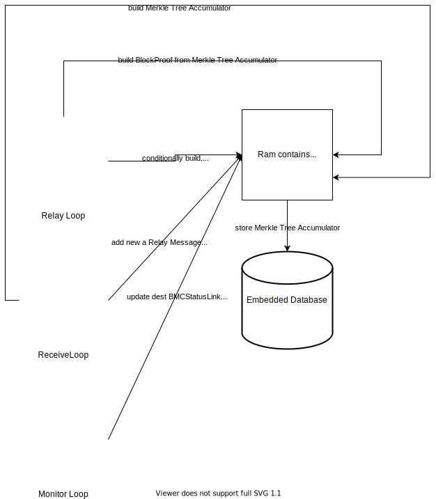
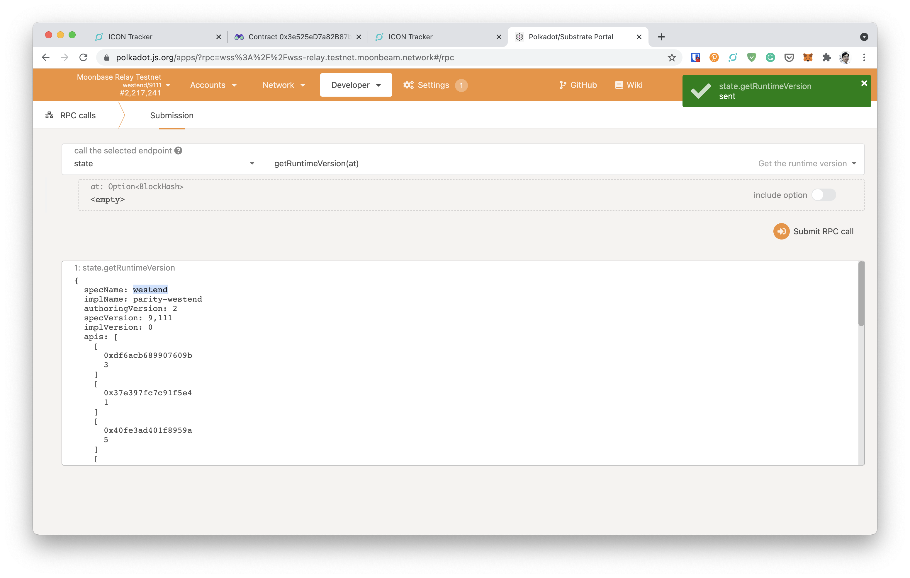

# BMR (BTP Message Relay)

## Introduction

* Unidirectional relay
* Monitor BTP events  
* Gather proofs for the events

BTP use a trustless verification method to prove a transaction origin and destination. Firstly, origin network will use [pbft](#practical-byzantine-fault-tolerance-pbft) algorithm to finalize the given block, at the precommits, the neccessary amount of validator/block producer signature will be on BlockHeader. If the amount is sufficient, the BlockHeader is considered as finalized by the origin network. From the verified BlockHeader, a field of State/Receipt/Storage hash contains the Merkle Proof root of events, using this field we can have a prove the validity of BTP event.

```
RelayMessage
    BlockUpdates -> BlockHeader + Votes
    BlockProofs -> BlockHeader + MTA witness
    ReceiptProofs -> Events contains (BTPMessage) + StateRoot in BlockHeader
```

When the ReceiptProofs of the BTPMessage with found in the block smaller of BMV (BTP Message Verifier) MTA (Merkle Tree Acummulator) height. BMR need to send the BlockHeader again, BMV need to prove that BlockHeader is valid, so we BMR build MTA witness. So when BMR send a BlockProof the condition is BTPMessage found with a correct sequence and BTPMessage found and the blocks contains BTPMessage is smaller than BMV MTA height.

### Practical byzantine fault tolerance (pbft)

- Votes: how validators/block producers confirm the finality of a block at PreCommit stage. Reference to thesis (https://www.microsoft.com/en-us/research/wp-content/uploads/2017/01/thesis-mcastro.pdf) thes
- Depends on each chain implementation, for ICON please check [icon doc](icon.md), for Polkadot parachain with Frontier support please check [parachain doc](polkadot_parachain_with_frontier.md)

## Integrated blockchain
* [ICON](icon.md)
* [ICON Enterprise Edition](iconee.md)
* [Polkadot/Kusama Parachain with Frontier Support](polkadot_parachain_with_frontier.md)
  * Moonbeam/Moonriver

## General
* [Build Guide](build.md): please notice that for BMR, we only need to build executables
* [Keystore](keystore.md)
* [PoC ICON-ICON Tutorial](tutorial.md)

## Overall architecture


## Simple run with Moonbeam developmnent node

* Example assumptions
  * ICON endpoint is `http://goloop:9080/api/v3/icon`
  * Moonriver endpoint are `wss://moonbeam:34008` and `http://moonbeam:34007`
  * ICON BMC BTP address: `btp://0x3.icon/cx8eb24849a7ceb16b8fa537f5a8b378c6af4a0247`
  * PRA BMC BTP address: `btp://0x501.pra/0x5b5B619E6A040EBCB620155E0aAAe89AfA45D090`

* To generate relay keystore: please follow [keystore](keystore.md).
* To get BMCStatusLink, to getStatus get offset and check relays list contains address of relay keystore
  1. dst chain is goloop/gochain: please run multiple instructions as below
    ```bash
      $ goloop rpc --uri http://goloop:9080/api/v3/icon \
          call --to $JAVA_SCORE_BMC_ADDRESS \
          --method getStatus \
          --param _link=$BTPSIMPLE_SRC_ADDRESS
      # Example
      $ goloop rpc --uri http://goloop:9080/api/v3/icon \
        call --to cx8eb24849a7ceb16b8fa537f5a8b378c6af4a0247 \
        --method getStatus \
        --param _link=btp://0x501.pra/0x5b5B619E6A040EBCB620155E0aAAe89AfA45D090
      {
        "block_interval_dst": "0x3e8",
        "block_interval_src": "0x7d0",
        "cur_height": "0x14d54",
        "delay_limit": "0x3",
        "max_agg": "0x10",
        "relay_idx": "0x0",
        "relays": [
          {
            "address": "hx2dbd4f999f0e6b3c017c029d569dd86950c23104",
            "block_count": "0xd00",
            "msg_count": "0x0"
          }
        ],
        "rotate_height": "0x137ea",
        "rotate_term": "0x8",
        "rx_height": "0xca",
        "rx_height_src": "0x16770",
        "rx_seq": "0x0",
        "tx_seq": "0x2",
        "verifier": {
          "height": "0x235fe",
          "last_height": "0x234a0",
          "offset": "0x234a0"
        }
      }

      $ echo $((0x234a0))
      144544
    ```
  2. dst chain is EVM: please run multiple instructions as below
  
    ```javascript
      $ make dist-sol
      $ export SOLIDITY_DIST_DIR=${PWD}/build/contracts/solidity
      $ yarn install --production --cwd $SOLIDITY_DIST_DIR/bmc
      $ truffle console --network moonbeamlocal
      $ truffle(moonbeamlocal)> let bmcPeriphery = await BMCPeriphery.at("0x5b5B619E6A040EBCB620155E0aAAe89AfA45D090")
      $ truffle(moonbeamlocal)> await bmcPeriphery.getStatus("btp://0x3.icon/cx8eb24849a7ceb16b8fa537f5a8b378c6af4a0247")
      // Example of BMCStatusLink
      [
        '0',
        '26',
        [
          '3710',
          '3562',
          '490',
          '0x',
          heightMTA: '3710',
          offsetMTA: '3562',
          lastHeight: '490',
          extra: '0x'
        ],
        [
          [
            '0x3Cd0A705a2DC65e5b1E1205896BaA2be8A07c6e0',
            '3220',
            '0',
            addr: '0x3Cd0A705a2DC65e5b1E1205896BaA2be8A07c6e0',
            blockCount: '3220',
            msgCount: '0'
          ]
        ],
        '0',
        '94486',
        '15',
        '3',
        '5',
        '3710',
        '92401',
        '1000',
        '3000',
        '171550',
        rxSeq: '0',
        txSeq: '26',
        verifier: [
          '3710',
          '3562',
          '3710',
          '0x',
          heightMTA: '3710',
          offsetMTA: '3562', # Offset is here
          lastHeight: '3710',
          extra: '0x'
        ],
        relays: [
          [
            '0x3Cd0A705a2DC65e5b1E1205896BaA2be8A07c6e0',
            '3220',
            '0',
            addr: '0x3Cd0A705a2DC65e5b1E1205896BaA2be8A07c6e0',
            blockCount: '3220',
            msgCount: '0'
          ]
        ],
        relayIdx: '0',
        rotateHeight: '94486',
        rotateTerm: '15',
        delayLimit: '3',
        maxAggregation: '5',
        rxHeightSrc: '490',
        rxHeight: '92401',
        blockIntervalSrc: '1000',
        blockIntervalDst: '3000',
        currentHeight: '171550'
      ]
      ```

* Build btpsimple executable:

```bash
make
# or
make **btpsimple**
```

* To create a configuration file
  ```bash
    # Make sure btpsimple executable exist
    make btpsimple
    
    # Set btpsimple in path
    export PATH="$PATH:${PWD}/bin"

    BTPSIMPLE_CONFIG=path/to/config/dst.config.json \
    BTPSIMPLE_SRC_ADDRESS=btp://0x3.icon/cx8eb24849a7ceb16b8fa537f5a8b378c6af4a0247 \
    BTPSIMPLE_SRC_ENDPOINT=http://goloop:9080/api/v3/icon \
    BTPSIMPLE_DST_ADDRESS=btp://0x501.pra/0x5b5B619E6A040EBCB620155E0aAAe89AfA45D090 \
    BTPSIMPLE_DST_ENDPOINT=wss://moonbeam:34008 \
    BTPSIMPLE_OFFSET=3562 \
    BTPSIMPLE_KEY_STORE=path/to/config/dst.ks.json \
    BTPSIMPLE_KEY_SECRET=path/to/config/dst.secret \
    BTPSIMPLE_LOG_WRITER_FILENAME=path/to/config/log/dst.log \
    ./entrypoint.sh
  ```
* To run a btpsimple
  ```bash
  bin/btpsimple start --config path/to/config/dst.config.json
  ```

## Run with Moonbeam Public Network and RelayChain

* Example assumptions
  * ICON endpoint is `[http://goloop:9080/api/v3/icon](https://btp.net.solidwallet.io/api/v3/icon_dex)`
  * Moonriver endpoint are `wss://wss.testnet.moonbeam.network` and `https://rpc.testnet.moonbeam.network`
  * ICON BMC BTP address: `btp://0x42.icon/cx11a5a7510b128e0ab16546e1493e38b2d7e299c3`
  * PRA BMC BTP address: `btp://0x507.pra/0x3e525eD7a82B87bE30cdADE89d32204cA0F1C356`

* To generate relay keystore: please follow [keystore](keystore.md).
* To get BMCStatusLink, to getStatus get offset and check relays list contains address of relay keystore
  1. dst chain is goloop/gochain: please run multiple instructions as below
    ```bash
      $ GOLOOP_RPC_URI="https://btp.net.solidwallet.io/api/v3/icon_dex" \
          call --to $JAVA_SCORE_BMC_ADDRESS \
          --method getStatus \
          --param _link=$BTPSIMPLE_SRC_ADDRESS
      # Example
      $ GOLOOP_RPC_URI="https://btp.net.solidwallet.io/api/v3/icon_dex" \
        goloop rpc call --to cx11a5a7510b128e0ab16546e1493e38b2d7e299c3 \
        --method getStatus \
        --param _link=btp://0x507.pra/0x3e525eD7a82B87bE30cdADE89d32204cA0F1C356
      {
        "block_interval_dst": "0xc",
        "block_interval_src": "0x7d0",
        "cur_height": "0x4efbd2",
        "delay_limit": "0x2",
        "max_agg": "0xa",
        "relay_idx": "0x0",
        "relays": [
          {
            "address": "hx2dbd4f999f0e6b3c017c029d569dd86950c23104",
            "block_count": "0x402",
            "msg_count": "0x3"
          }
        ],
        "rotate_height": "0x4efb99",
        "rotate_term": "0x1",
        "rx_height": "0x4ee330",
        "rx_height_src": "0xffd6f",
        "rx_seq": "0x3",
        "sack_height": "0x0",
        "sack_next": "0x0",
        "sack_seq": "0x0",
        "sack_term": "0x0",
        "tx_seq": "0x4",
        "verifier": {
          "height": "0x100062",
          "last_height": "0xffd6f",
          "offset": "0xffc60"
        }
      }

      $ echo $((0xffc60))
      1047648
    ```
  2. dst chain is EVM: please run multiple instructions as below
  
    ```javascript
      $ make dist-sol-bmc
      $ export SOLIDITY_DIST_DIR=${PWD}/build/contracts/solidity
      $ truffle console --network moonbase --working_directory $SOLIDITY_DIST_DIR/bmc
      $ truffle(moonbase)> let bmcP = await BMCPeriphery.at("0x3e525eD7a82B87bE30cdADE89d32204cA0F1C356")
      $ truffle(moonbase)> bmcP.getStatus("btp://0x42.icon/cx11a5a7510b128e0ab16546e1493e38b2d7e299c3")
      [
        '3',
        '3',
        [
          '5176449',
          '5173762',
          '5169389',
          '0x',
          heightMTA: '5176449',
          offsetMTA: '5173762',
          lastHeight: '5169389',
          extra: '0x'
        ],
        [
          [
            '0x126AD520629a0152b749Af26d5fd342Cb67Ac6CE',
            '8831',
            '3',
            addr: '0x126AD520629a0152b749Af26d5fd342Cb67Ac6CE',
            blockCount: '8831',
            msgCount: '3'
          ]
        ],
        '0',
        '1048846',
        '1',
        '3',
        '10',
        '5167618',
        '1047957',
        '1000',
        '12',
        '1048846',
        rxSeq: '3',
        txSeq: '3',
        verifier: [
          '5176449',
          '5173762',
          '5169389',
          '0x',
          heightMTA: '5176449',
          offsetMTA: '5173762',
          lastHeight: '5169389',
          extra: '0x'
        ],
        relays: [
          [
            '0x126AD520629a0152b749Af26d5fd342Cb67Ac6CE',
            '8831',
            '3',
            addr: '0x126AD520629a0152b749Af26d5fd342Cb67Ac6CE',
            blockCount: '8831',
            msgCount: '3'
          ]
        ],
        relayIdx: '0',
        rotateHeight: '1048846',
        rotateTerm: '1',
        delayLimit: '3',
        maxAggregation: '10',
        rxHeightSrc: '5167618',
        rxHeight: '1047957',
        blockIntervalSrc: '1000',
        blockIntervalDst: '12',
        currentHeight: '1048846'
      ]
      ```

* Build btpsimple executable:

```bash
make
# or
make **btpsimple**
```

* To create a configuration file
  ```bash
    # Make sure btpsimple executable exist
    make btpsimple
    
    # Set btpsimple in path
    export PATH="$PATH:${PWD}/bin"

    BTPSIMPLE_CONFIG=path/to/config/dst.config.json \
    BTPSIMPLE_SRC_ADDRESS=btp://0x42.icon/cx11a5a7510b128e0ab16546e1493e38b2d7e299c3 \
    BTPSIMPLE_SRC_ENDPOINT=https://btp.net.solidwallet.io/api/v3/icon_dex \
    BTPSIMPLE_DST_ADDRESS=btp://0x507.pra/0x3e525eD7a82B87bE30cdADE89d32204cA0F1C356 \
    BTPSIMPLE_DST_ENDPOINT=wss://wss.testnet.moonbeam.network \
    BTPSIMPLE_OFFSET=3562 \
    BTPSIMPLE_KEY_STORE=path/to/config/dst.ks.json \
    BTPSIMPLE_KEY_SECRET=path/to/config/dst.secret \
    BTPSIMPLE_LOG_WRITER_FILENAME=log/icon2pra.btp.moonbase.log \
    ./entrypoint.sh
  ```
* To run a btpsimple
  ```bash
  bin/btpsimple start --config path/to/config/dst.config.json
  ```

For the flow from Parachain to ICON, it's requires options in "src.options"
- relayEndpoint: is the websocket or http endpoint of relay chain
- relayBtpAddress: is btp of relaychain with specname 
- iconEndpoint: the iconEndpoint similar in dst endpoint
- iconBmvAddress: Parachain BMV smart contracts on ICON network to get MTA of relaychain
- relaychainOffset: is the Relaychain MTA offset

Example
```json
{
  "base_dir": ".",
  "src": {
    "address": "btp://0x507.pra/0x7ccEE5DDc2cE545fEa75b7B398dFAC9419A18624",
    "endpoint": "wss://wss.testnet.moonbeam.network",
    "options": {
      "relayEndpoint": "wss://wss-relay.testnet.moonbeam.network",
      "relayBtpAddress": "btp://westend.relay/",
      "iconEndpoint": "https://btp.net.solidwallet.io/api/v3/icon_dex",
      "iconBmvAddress": "btp://0x42.icon/cx4e658b8a0590c4c1a74a8f53d762c8d5e89a81cc",
      "relayOffset": 2126340
    }
  },
  "dst": {
    "address": "btp://0x42.icon/cx8c97ee5a26801a168bf7b7708a73d14cec3d6ad5",
    "endpoint": "https://btp.net.solidwallet.io/api/v3/icon_dex"
  },
  "offset": 1007699,
  "key_store": {},
  "key_secret": "...",
  "log_level": "trace",
  "console_level": "debug",
  "log_forwarder": {
    "vendor": "",
    "address": "",
    "level": "info",
    "name": ""
  },
  "log_writer": {
    "filename": "log/pra2icon.btp.moonbase.log",
    "maxsize": 1,
    "maxage": 0,
    "maxbackups": 0,
    "localtime": false,
    "compress": false
  }
}
```
## Run in docker container

TODO wait for docker implementation

## Management
* [btpsimple command line](btpsimple_cli.md)

## Testing

```bash
# Test all in short mode, with log, without cache
go test -v -count=1 -short ./...  
```

```bash
# Test all with log, without cache
go test -v -count=1 ./...  
```