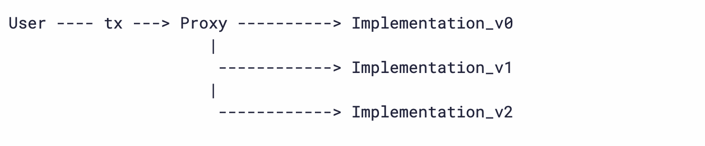
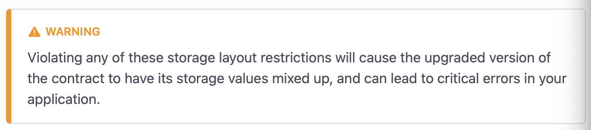
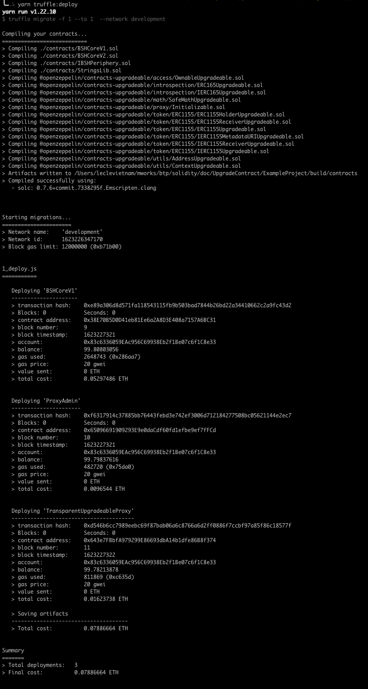
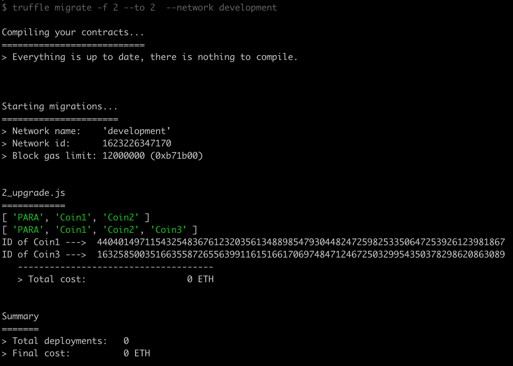

<center> <h2>Contract Upgradeability</h2> </center>

### Why do we need to upgrade a contract?

_____
In Ethereum, smart contracts, by default, are immutable. When contracts are created and deployed, it cannot be modified. However, it indeed is expect to be able to modify for some cases, i.e. fixing bugs, adding additional features during the development of a project, or just simply change logic of implementations. Thus, contract upgradedability is an essential feature that developers obviously need when developing their project.

### How contract upgradeability works?

_____
Basically, the idea is using a proxy for upgrading contracts. When your smart contract is deployed, it would be splitted into two parts - a `proxy contract` that holds contract's state variables and a second contract that contains logic implementations. When interacting with a contract, users actually interact directly with a wrapper `proxy contract` which is in charge of delegating transaction calls to and from the logic implementation contract. From this design, we can obviously perceive a key concept that is the `proxy contract` must not be altered whereas the logic contract implementation can be replaced or upgraded. The contract's state variables therein are still maintained whereas the wrapper `proxy contract` can point to a different logic implementation in doing so called "contract upgradability"



For more information, you can check this link [here](https://docs.openzeppelin.com/upgrades-plugins/1.x/proxies)

### Upgrading Contracts using the Openzeppelin Upgrades Plugins

_____
In this project, we are going to use the OpenZeppelin Upgrades for providing an easy to use, simple, robust, and opt-in upgrading mechanism for our smart contracts. Contracts are going to be deployed with upgradability using Openzeppelin Upgrades Plugins. You will need to use the Upgrade Safe variant of Openzeppelin Contracts which is available as a seperate package called `@openzeppelin/contracts-upgradeable`. This package is likely the same as the structure of the regular Openzeppelin Contracts package, but every file and contract is added the suffix `Upgradeable`

For more information, please check out these links: [here](https://docs.openzeppelin.com/contracts/3.x/upgradeable) and [here](https://docs.openzeppelin.com/learn/upgrading-smart-contracts)

### Cautions in Writing Upgradeable Contracts

_____

There are a few rules of thumb to keep in mind when writing/upgrading your Solidity code, especially when working with upgradeable contracts using Openzeppelin Upgrades libraries.  

<span style="color:red"> **DON'T**</span>

* Do not write any `constructor` in your smart contracts. You can write your Solidity contracts with Openzeppelin Upgrades regularly, except for the constructors. Please check it out for the reasons behind this restriction [here](https://docs.openzeppelin.com/upgrades-plugins/1.x/proxies#the-constructor-caveat). Please be aware that the restriction affects your contracts, but also the contracts that you import from a library.

* Do not initialize a value in field declarations. But, it is fine to define a constant state variables. For example:

```solidity
contract ExampleContract {
    uint256 private version = 1;  // Don't
    uint256 private constant DECIMAL_PRECISION = 10**6; // Fine
}
```

* Do not create new instances from your contract code. This creation is handled directly by Solidity and not by Openzeppelin Upgrades. Hence, it would not be upgradeable. For example: 

```solidity
// contracts/MyContract.sol
// SPDX-License-Identifier: MIT
pragma solidity ^0.6.0;

import "@openzeppelin/contracts-upgradeable/proxy/Initializable.sol";
import "@openzeppelin/contracts/token/ERC20/ERC20.sol";

contract MyContract is Initializable {
    ERC20 public token;

    function initialize() public initializer {
        token = new ERC20("Test", "TST"); // This contract will not be upgradeable
    }
}
```

* Please be aware that do not use either `selfdestruct` nor `delegatecall` in your contracts. If your contract contains these restrictions, it is likely failed to make your contract upgradaeble.

* Please be cautious that you cannot change the order of contract's state variables and also their types.


* Do not introduce a new state variable before existing ones.

<span style="color:green"> **DO**</span>

* Only allow Proxy Admin to upgrade contracts.

* Should be familiar with and have a basic understanding of what a proxy is.

* Have to know how to write an upgradeable smart contracts.

* Instead of using `constructors`, your contracts should use `initializer` functions.

* Initializing values of state variables, when a contract is deployed, can be placed inside the `initializer` functions. Please be aware that the `initializer` function can be called only once when a contract is firstly deployed. 

* Always extend storage (adding more state variables) instead of modifying it, i.e. removing state variables, changing a layout order of state variables.

* When new state variables are added, make sure that these variables would be added at the end of existing ones. For example:

```solidity
//  Before adding a new state variable
contract ExampleContract {
    uint256 private version;
    string private network;
}
```

```solidity
//  After adding a new state variable
contract ExampleContract {
    uint256 private version;
    string private network;
    address owner;
}
```

* Logic implementations can be modified without any restrictions which means that you can either modify current implementation to fix bug, remove existing functions, or adding more functions provide additional features of your project at any part of your codes

For more instructions, please check out this link [here](https://docs.openzeppelin.com/upgrades-plugins/1.x/writing-upgradeable)

### How to Deploy and Upgrade Smart Contracts using Truffle and Openzeppelin SDK

_____

```
Requirement:
- Truffle v5.3.0 (core: 5.3.0)
- Solidity v0.5.16 (solc-js)
- Node v15.12.0
- Web3.js v1.2.
- @openzeppelin/contracts-upgradeable": "^3.4.1-solc-0.7-2"
- @openzeppelin/truffle-upgrades": "^1.7.0"
```
**Required Files:**

>   - BSHCoreV1: version 1 of BSHCore contract [BSHCoreV1](BSHCoreV1.sol)
>   - BSHCoreV2: version 2 of BSHCore contract [BSHCoreV2](BSHCoreV2.sol)
>   - IBSHPeriphery: interface contract of BSHPeriphery [IBSHPerif](IBSHPeriphery.sol)
>   - Strings: utility library [Strings](StringsLib.sol)
>   - Truffle Configuration: [truffle-config.js](truffle-config.js)
>   - NodeJS package JSON: [package.json](package.json)
>   - Migration javascript: script to deploy/upgrade contract to local network [script](1_upgradeable.js)

* Installation and Preparation:
```cmd
npm install --global truffle yarn ganache-cli

//  cd back to folder 'ExampleProject'
yarn

//  Open new command window and run a following command
ganache-cli -l 12000000 --allowUnlimitedContractSize
```

* Deploy and Upgrade Contract using Truffle:

**Note that: This is just an example to show how to deploy and to upgrade a contract using a local network. When deploying and upgrading your contract to the mainnet, please make sure you understand how to do it properly.**

**1_deploy.js**: a script to deploy example contract to a local network
```javascript
const BSHCoreV1 = artifacts.require("BSHCoreV1");
const { deployProxy } = require('@openzeppelin/truffle-upgrades');

var _uri = 'https://1234.iconee/';
var _native_coin = 'PARA';

module.exports = async function (deployer, network) {
    /********************************************************************************************** 
                                Deploy A Contract and the Proxy Contract
    - Before running a script, make sure to delete 
        + a file '.openzeppelin/unknown-1337.json' (if existed)
    - Deploy the first part by a following command: `yarn truffle:deploy`
    **********************************************************************************************/

    await deployProxy(BSHCoreV1, 
        [_uri, _native_coin],   //  calling initialize() and passing params into initialize()
        { deployer }              //  specify an account to deploy a contract
                                //  if omit, default 'deployer' will be chosen
    );
    const version1 = await BSHCoreV1.deployed();
    await version1.register("Coin1");
    await version1.register("Coin2");
}
```

**2_upgrade.js**: a script to upgrade deployed contract
```javascript
const BSHCoreV2 = artifacts.require("BSHCoreV2");
const ProxyAddr = require('../.openzeppelin/unknown-1337.json');
const { upgradeProxy } = require('@openzeppelin/truffle-upgrades');

var _uri = 'https://1234.iconee/';
var _native_coin = 'PARA';

module.exports = async function (deployer, network) {
    /********************************************************************************************** 
    - Upgrade the contract by a following command: `yarn truffle:upgrade`
    **********************************************************************************************/

    await upgradeProxy(ProxyAddr.proxies[0].address, BSHCoreV2);
    const version2 = await BSHCoreV2.deployed();
    //  It prints out an array of three: 'PARA', 'Coin1', and 'Coin2'
    console.log(await version2.coinNames());
    await version2.register("Coin3");
    //  It prints out an array of four: 'PARA', 'Coin1', 'Coin2', 'Coin3'
    console.log(await version2.coinNames());
    var coin1_id = await version2.coinId('Coin1');
    var coin3_id = await version2.coinId('Coin3');
    console.log('ID of Coin1 ---> ', web3.utils.BN(coin1_id).toString());
    console.log('ID of Coin3 ---> ', web3.utils.BN(coin3_id).toString());
};
```

---The first file `1_deploy.js` is to depploy a contract and also a Proxy Contract.
```javascript
const ProxyAddr = require('../.openzeppelin/unknown-1337.json');
``` 
before running a script command 
```
yarn truffle:deploy
```
 After running a command, you would have a result as:
 

 There are three contracts being created:

 - Your logic contract implementation **BSHCoreV1**

 - **Proxy Admin** contract which takes responsibility to save and validate an authority to upgrade the Proxy Contract

 - Proxy Contract (**TransparentUpgradeableProxy**) is the contract that all Users would interact with instead of **BSHCoreV1** contract's address

 ---Next, run the second file `2_upgrade.js` to upgrade **BSHCoreV1** contract to **BSHCoreV2**.

```
yarn truffle:upgrade
```
You would, thereafter have a result as:
